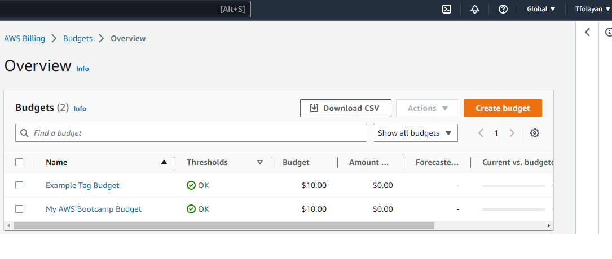

# Week 0 — Billing and Architecture

## Required Homework

### MFA added for extra security
I added Multif-Factor Aunthentification for added security

### Create a new IAM User
I created another user to my account

### AWS CLI and gitpod.yml code confimation
I installed AWS CLI and added the gitpod.yml code

### Create A Billing Alarm
I created Billing Alarms with my billing preferences checked in.

### Create A Budget Alarm

I created only 2 $10 budgets because I didn't want to go over the limit.

### Recreate Logical Architecture Design
I created my Logical Design from Lucid Charts and I think I did a good job.

### Conceptual Diagram (Napkin) of Cruddur
I created a masterpiece drawing of my Cruddur Conceptual Diagram

### Student Portal Checklist Week 0
Completed All required tasks for Week 0

