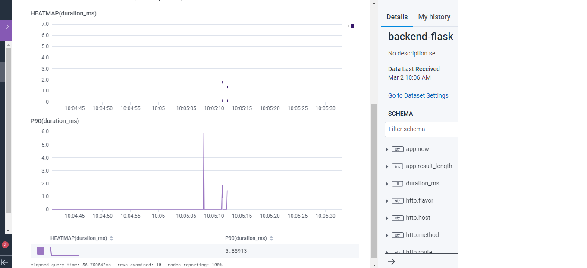

# Week 2 — Distributed Tracing

## Required Homework
This week I focused on Observability, where I can view the logs and traces of the programs I am using in order to view my progress and pinpoint specific errors.

### Instrument Honeycomb with OTEL
In this image I show the installation of Honeycomb using opentelemetry in my gitpod app.py file.

### Honeycomb Trace
In this screenshot, I show an image of my first trace on Honeycomb.

### Honeycomb Heatmap/P90
In this screenshot, I show an image of the heatmap and P90 durayion results from the trace.

### AWS X-RAY Group
In this screenshot, I use AWS X-Ray service to create a group called Cruddur.

### X-RAY Trace
In this screenshot, I show the traces from the Cruddur X-Ray group.

### AWS Cloudwatch Logs Group
In this screenshot, I use AWS Cloudwatch to create a logs group called Cruddur.

### AWS Cloudwatch Logs Streams
In this screenshot, I showed all the logs streams from the Cruddur group.

### ROLLBAR
In this screenshot, I create my first project on Rollbar, and I show the traces from Cruddur.

