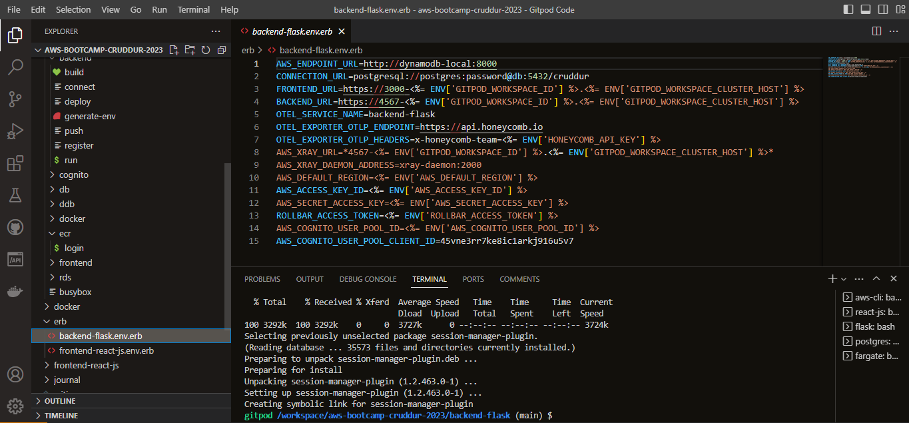

# Week 6/7 — Deploying Containers & Solving CORS with a Load Balancer and Custom Domain

## Required Homework
This week was very challenging! I created ECR repo from AWS and from gitpod using AWS CLI and Bash scripts. I created task definitions and deployed images from AWS and using AWS CLI. I was able to provision Load Balancers with target groups. I created and managed a new domain using Route53 via hosted zones. Created a SSL certificate via ACM and set SSM parameters via System Manager. I set up health checks for the services, tasks and load balancers. I refactored the directories in gitpod to make files more efficient and I streamlined the docker compose file to clean it up (using Ruby and Bash script to generate environment variables). But the thing that stood out to me most about this week, was the Trouble-shooting!!

### Create ECR Repo and Deploy 
Here I show each ECR action I implemented using bash script (login, build, push, etc). I put them under the bin/backend directory. Notice I also moved the bin directory to become a top directory as opposed to being located under the backend-flask directory. This made more sense because there are actions needed under the bin directory that were not exclusive to the backend-flask. 

Below you see both the Backend-Flask service and the Frontend-react-js service successfully deployed to AWS ECR Fargate.

Below is a cluster overview of those services to confirm that each task is Healthy.

### Create Load Balancer
Here I implemented a Load Balancer for the Backend and Frontend traffic.

### Register Domain & Create SSL Certificate
Below I registered a new domain and called it tayofolayan.com via hosted zone.

Below I successfully created SSL certificates via ACM.

### Update Load Balancer
Here I update the load balancer to accept traffic from ports 443 and 80, and I update the ALB listener rules accordingly.

### Turn on Container Insights for CloudWatch Monitoring
Below I updated the task definitions to contain XRAY

Below shows that Container Insights for CloudWatch Monitoring has been enabled.

### STreamline Docker-Compose.yml
Here I show what the updated Docker-compose.yml file looks like without all of the environment variables. In their place I added the env_file command that will generate all of the environment variables.

Below you can see that I added the environment variables to an ERB (Ruby) file.

Below you can see the Ruby bash script file that is used to generate the env_files.

