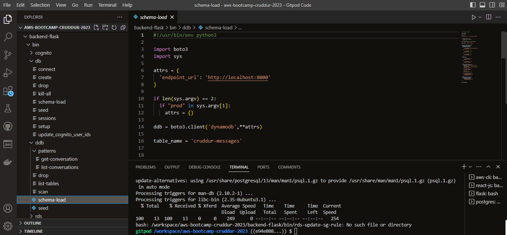

# Week 6/7 — Deploying Containers & Solving CORS with a Load Balancer and Custom Domain

## Required Homework
This week was very challenging! I created ECR repo from AWS and from gitpod using AWS cLI and Bash scripts. I created task definitions and deployed images from AWS and using AWS CLI. I was able to provision and Load Balancers with target groups. I created and managed a new domain using Route53 via hosted zones. Created a SSL certificate via ACM and set SSM parameters via System Manager. I set up health checks for the services, tasks and load balancers. I refactored the directories in gitpod to make files more efficient and I streamlined the docker compose file to clean it up (using Ruby and Bash script to generate environment variables). But the thing that stood out to me most about this week, was the Trouble-shooting!!

### Create ECR Repo and Deploy 
In this image I show the bash script files that I implemented to Create the database, run the schema, and seed the messages. The script can also be enable to drop the database.

