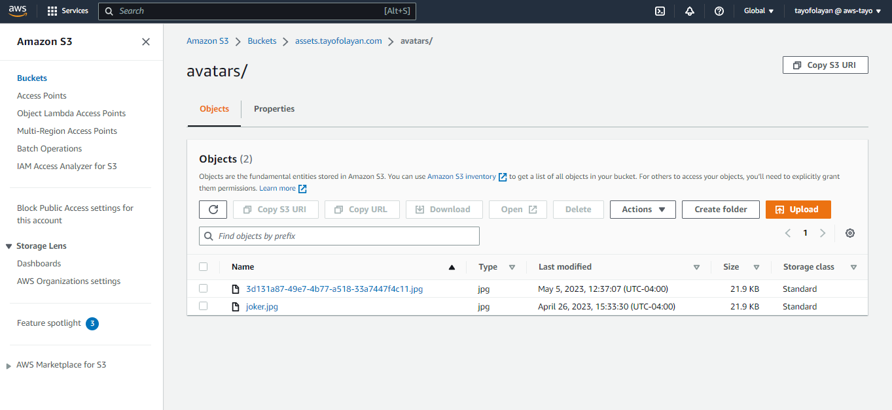
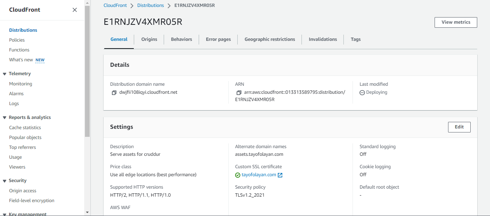
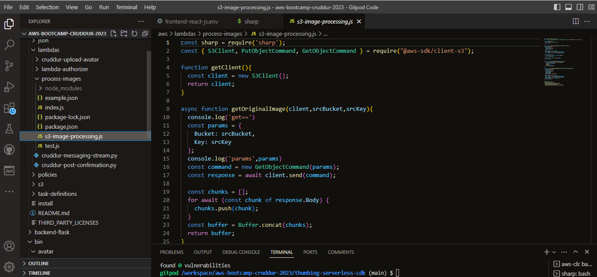
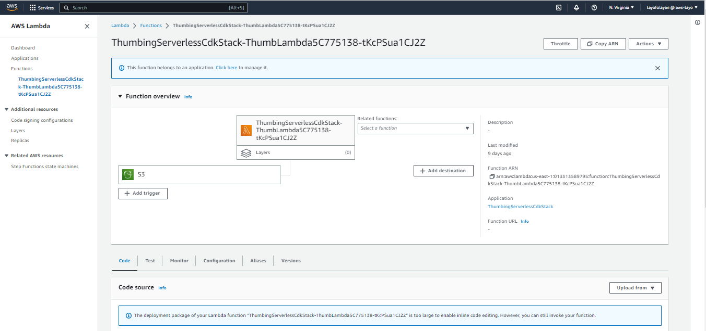
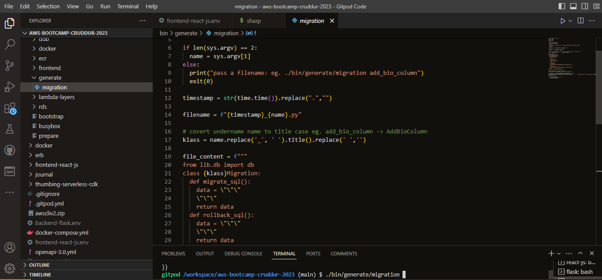
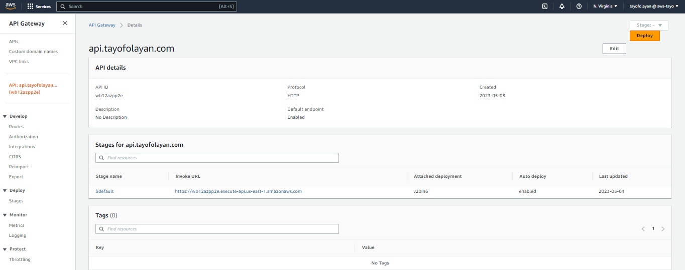
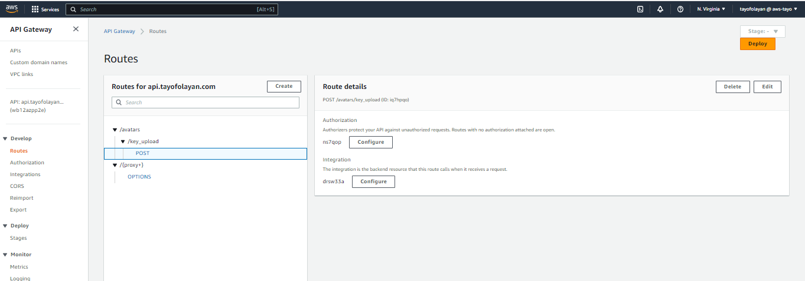
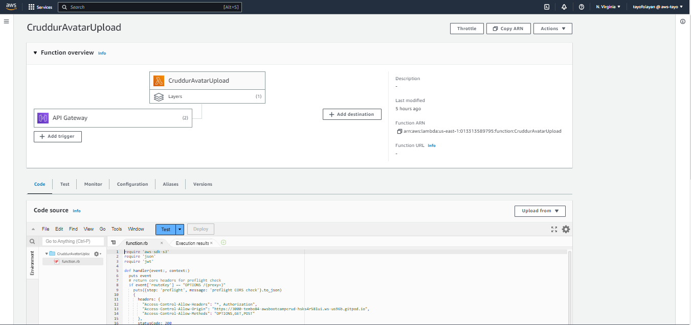
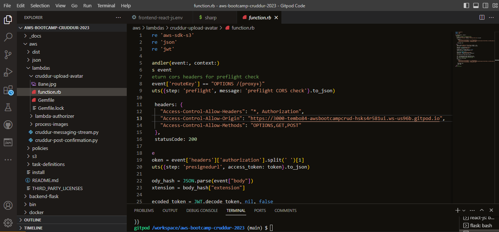
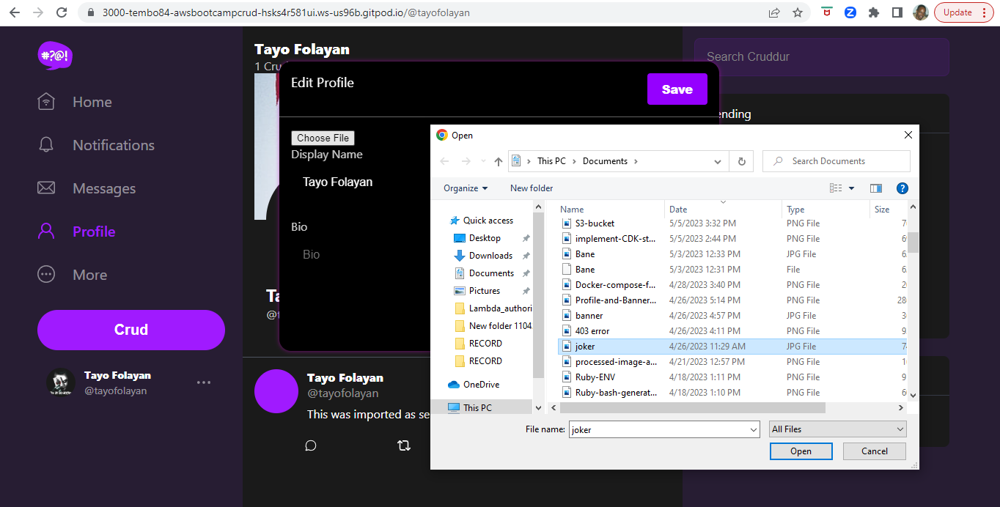

# Week 8 — Serverless Image Processing

## Required Homework
This week we used Serverless Image Processing to uplaod assets to an s3 bucket, that we could send to out application via cloudfront. We can also upload an asset to the bucket directly from our application using a presigned URL. Not only did I have to deal with the regular troubleshooting issues that I tend to cause myself, but Flask and Gitpod decided to pile-on and cause me additional headaches. These issues definitely set me back, but we joined together as a family in the bootcamp to resolve some of the issues (mainly Flask deprecation stuff). Then Andrew came to the rescue and helped us defeat the mighty Gitpod port "detecting" issue that sidelined a percentage of the bootcamp.

### Implement CDK Stack 
We started off this week by installing AWS CDK package to gitpod and implementing it to our AWS accounts. Here you can see the install process and all the packages/files listed on the directories.  

### Create S3 Bucket 
Here I create an S3 Bucket that will store processed images. I can store the image directly from AWS S3, or from Gitpod to S3 or directly from the application to S3.

### Serve Assets via Cloudfront 
Here I create an Cloudfront Distribution that I will use to serve Assets from the S3 bucket to my application.

### Lambda for Image Processing w/ S3 Trigger 
Here I show the Javascript file used to process the images/assets that will be stored in the S3 bucket.

Here is the Image Processing Lambda with the S3 trigger implemented.

### Migration
Here I show the bash script file that we implemented to migrate the backend over to the Cruddur application.

### API Gateway
Here is an image of the API Gateway I implemented to that the Crudder application can access the backend services.

Here is a picture showing the Avatars/Key_Upload route of the API Gateway, and showing the it is configured with Authorization (to protect the API against unauthorized requests) and Integration to the backend services.

And in the screenshot, a Lambda Authorizer has been implemented with the API Gateway as the trigger.

### Presigned URL Generation via Ruby Lambda
Here I implement a Lambda ruby function to generate a presigned URL.

Here is the Ruby file that generates a presigned URL.

### Render Avatars in App via CloudFront
Here is a screenshot of avatar being uploaded to a bucket client-side using a presigned URL. Essentially allowing me to upload the asset directly from the application.

## TROUBLESHOOTING
