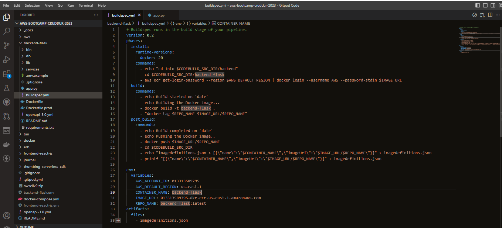
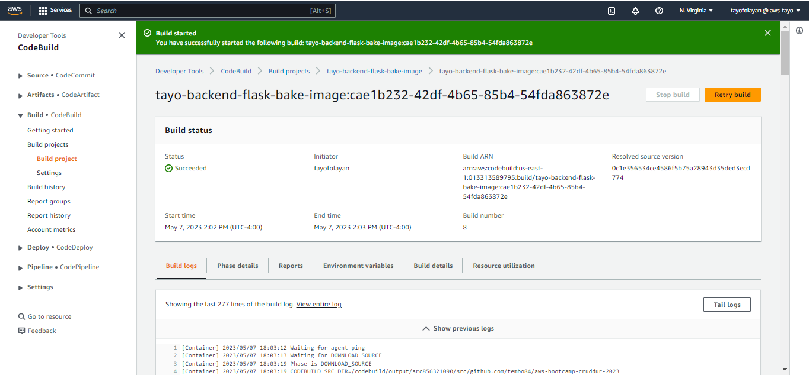
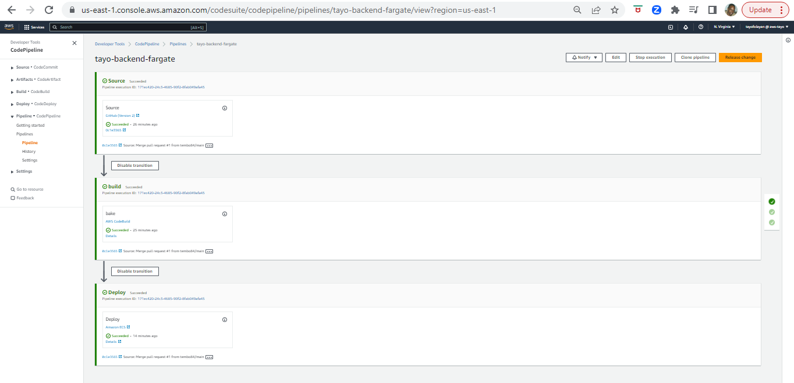

# Week 9 — CI/CD with CodePipeline, CodeBuild and CodeDeploy

## Required Homework
This week consisted of implementing a buildspec.yml file that will integrate with CodeBuild, configuring CodeBuild to integrate with CodePipeline and CodeDeploy.

### Create Buildspec.yml File 
We started off this week off by creating a Buildspec.yml file that would contain specific commands, installations and Environment variables necessary for configuring CodeBuild. Buildspec will run in the build stage of the pipeline.

### Configure CodeBuild Project
This image shows the successful configuration of my CodeBuild Project!

### Configure CodePipeline
And lastly, this is a screenshot of the successful deployment of CodePipeline. CodePipeline consists of a Source stage, a Build stage and the Deployment stage. As shown in the screenshot, each stage was successful in my pipeline!

