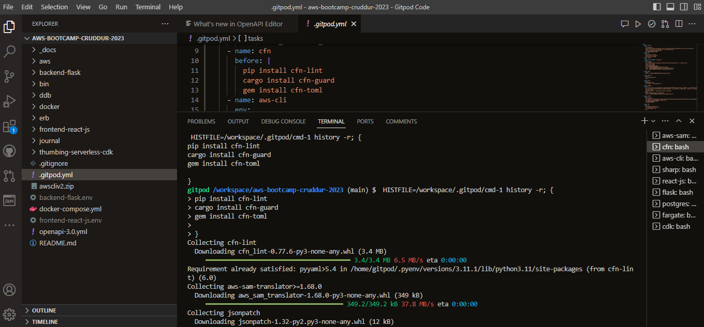
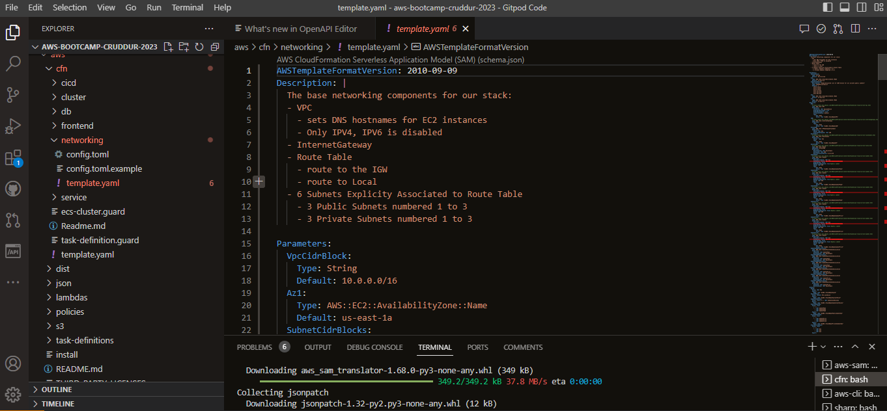

# Week 10/11 — CloudFormation (CFN) Part 1

## Required Homework
This week consisted of coverting the ClickOps infrastructure to CloudFormation and SAM templates.

### Implement Cloudformation and TOML installation 
We started off this week by installing CFN and CFN-Toml packages to gitpod and implementing it to our AWS accounts. Here you can see the install process.

### Implement CFN Networking Layer
Here I create and Networking Template yaml file and a config toml file, for the purpose of implementing and identifying the Networking Stack in Cloudformation. I also create a networking Bash script to deploy the stack to AWS Cloudformation.

Here is the config.toml file.

And here is the Networking bash script used to deploy the stack.

