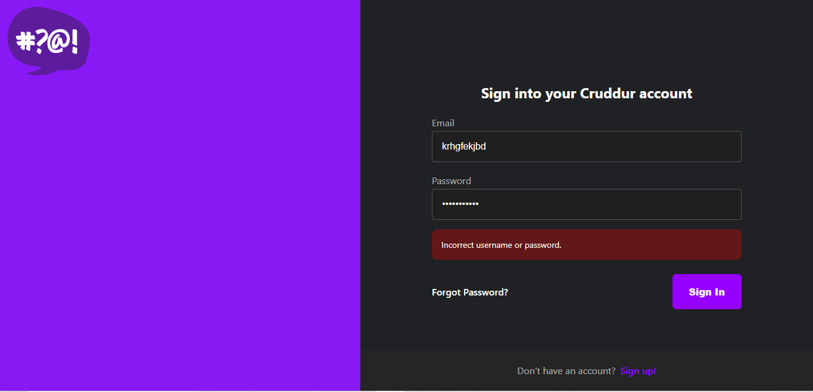
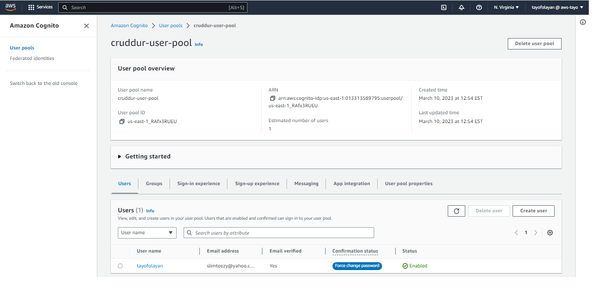
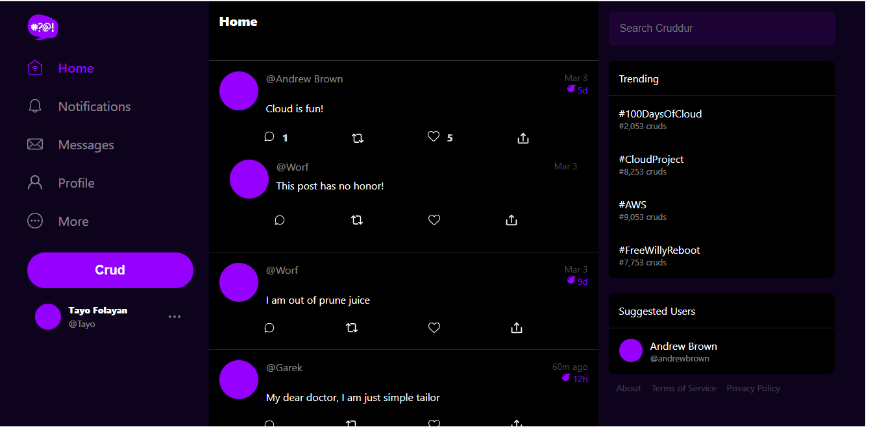
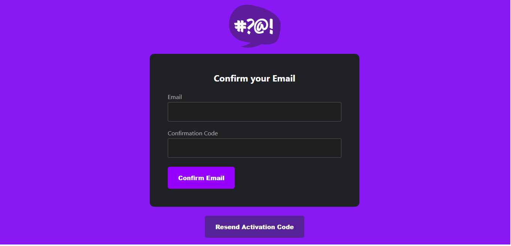

# Week 3 — Decentralized Authentication

## Required Homework
This week I focused on Authentication, where I implemented a sign-in page, a sign-up page and a recovery page in case someone forgets their sign-in credentials.

### Instrument Custom Sign-In Page
In this image I showed what the sign-in page looks after inputting incorrect sign-in credentails

### Create a user pool and user in AWS Cognito
In this screenshot I use AWS Cognito to create a user pool in order to verify that the sign-in page works correctly.

Here is a screenshot showing successful sign-in after implementing the AWS Cognito User Pool information (notice the unique user information in the bottom left corner of the application)

### Implement Custom Sign-Up Page
Here is a screenshot of the Comfirmation Page requestion confimation after signing up. 

