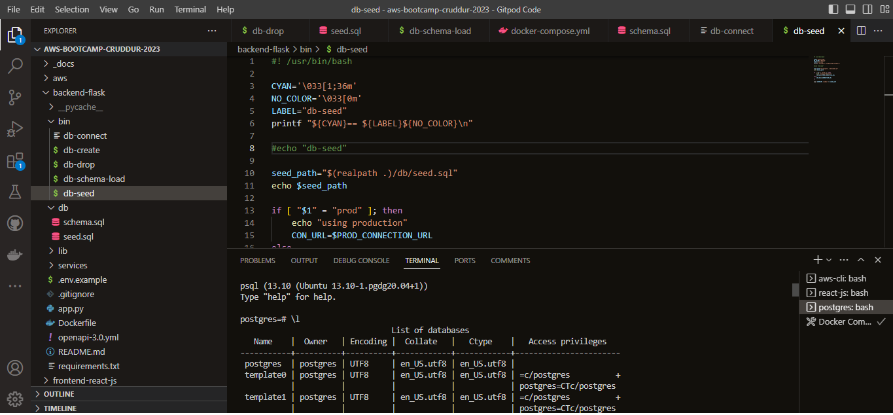
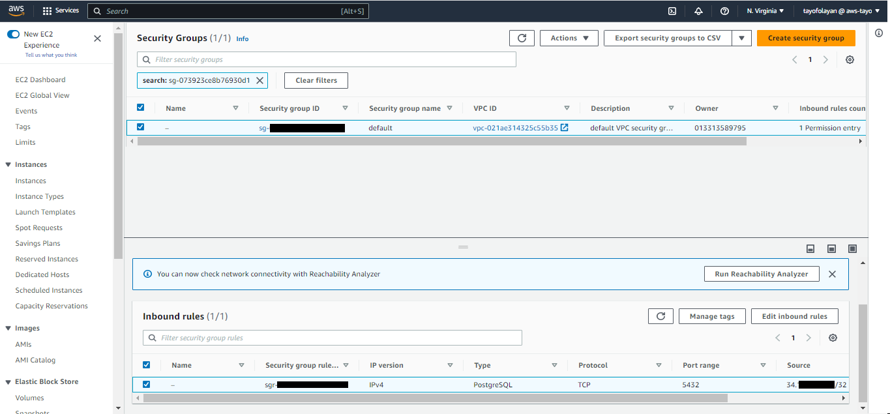
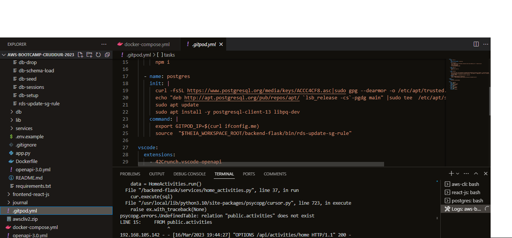
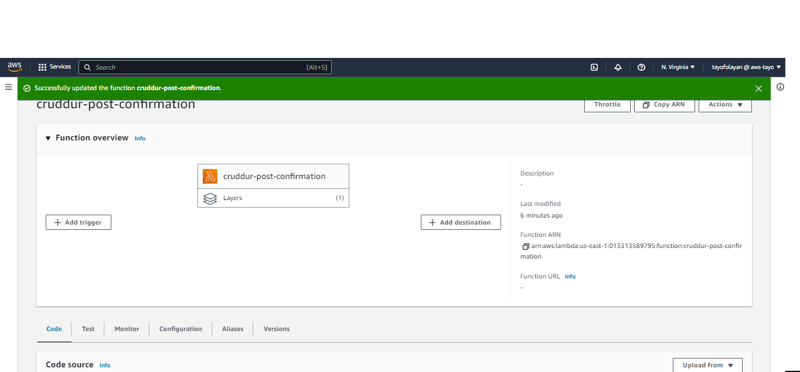

# Week 4 — Postgres and RDS

## Required Homework
This week I focused on Databases, where I implemented databases through AWS using Postgres on AWS RDS. I was also able to create a user on my Cruddur App via AWS Cognito through the AWS RDS database.

### Create a Postgres Instance
In this image I a Postgres Instance in my AWS RDS.

### Bash Script of DB actions
This is a screenshot of the one of the bash script files I created to execute the PostgreSQL commands.

### Connect Gitpod Postgres to AWS RDS
I established a connect of the Gitpod Postgres IP address to my AWS RDS instance.

### Save Postgres Commands to Gitpod.yml file
In order for the Postgres commands to install whenever I start a new Gitpod workspace, I installed the commands into my gitpod yaml file.

### AWS Lambda Function
I connected an AWS Lambda function to my RDS instance so that I could configure my Cruddur code to AWS.

