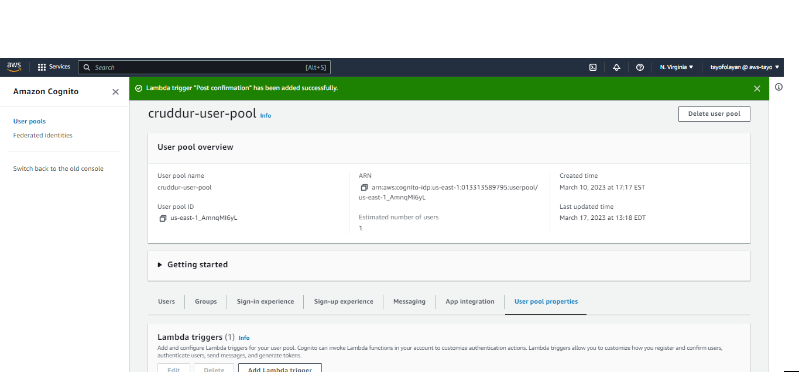
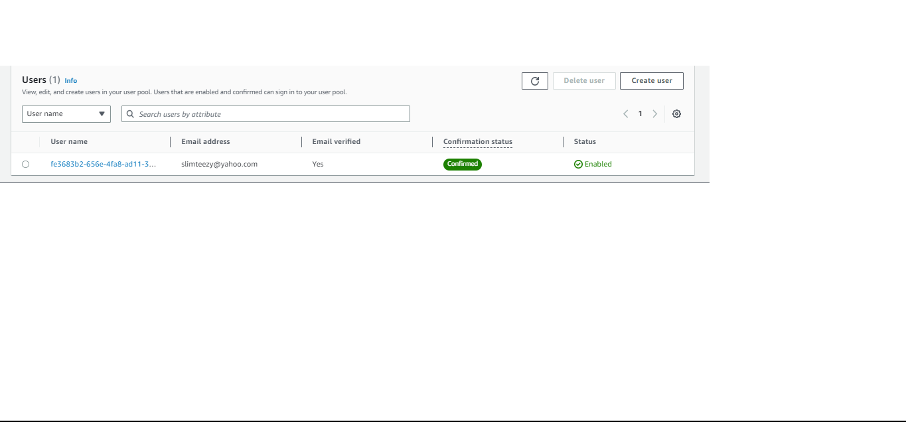

# Week 4 — Postgres and RDS

## Required Homework
This week I focused on Databases, where I implemented databases through AWS using Postgres on AWS RDS. I was also able to create a user on my Cruddur App via AWS Cognito through the AWS RDS database.

### Create a Postgres Instance
In this image I a Postgres Instance in my AWS RDS.

### Bash Script of DB actions
This is a screenshot of the one of the bash script files I created to execute the PostgreSQL commands.

### Connect Gitpod Postgres to AWS RDS
I established a connect of the Gitpod Postgres IP address to my AWS RDS instance.

### Save Postgres Commands to Gitpod.yml file
In order for the Postgres commands to install whenever I start a new Gitpod workspace, I installed the commands into my gitpod yaml file.

### AWS Lambda Function
I connected an AWS Lambda function to my RDS instance so that I could configure my Cruddur code to AWS.

### Create Congnito Trigger for Lambda Function
I created a trigger with AWS Cognito for the Lambda Function, so the Crudder App can create users and also log data using AWS cloudwatch.

Here is the user being created on Cognito from signing up through the Crudder app and verifying the confirmation email.

Here is an image of the VPC security group connecting Gitpod, Lambda/RDS and Cognito

### Cloudwatch Log data from Lambda Function
and here is the cloudwatch log data generated from the lambda fucntion after creating the cognito user.

