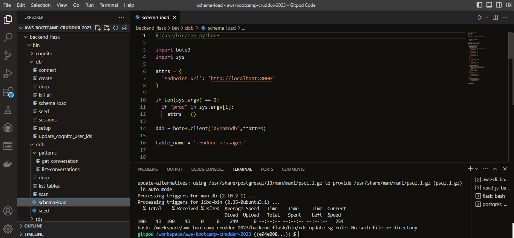
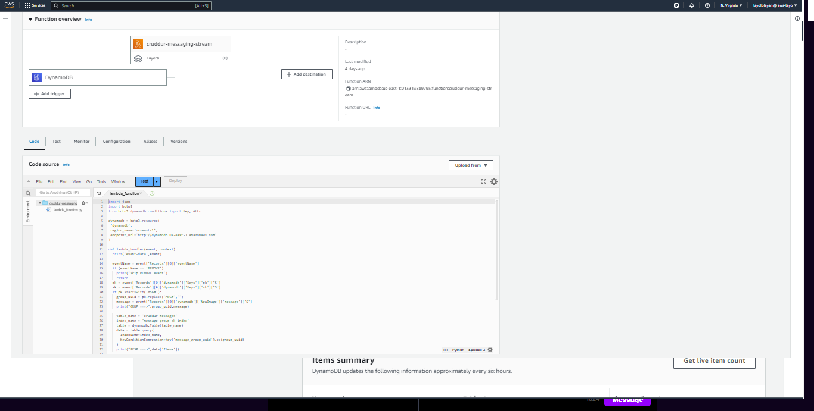
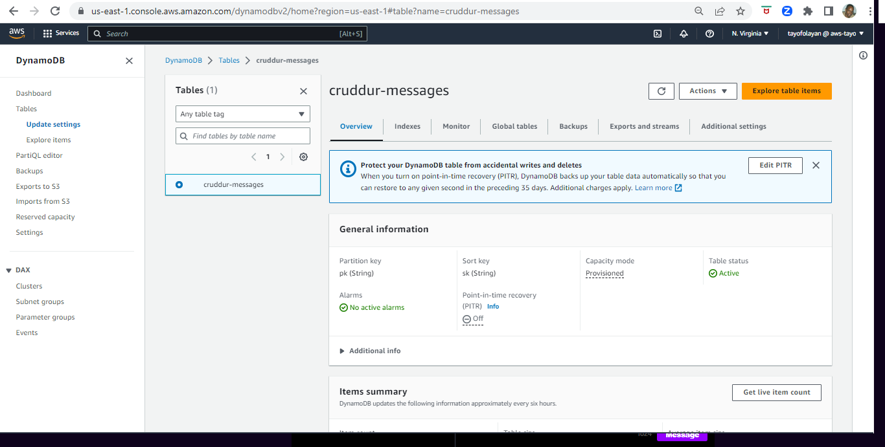
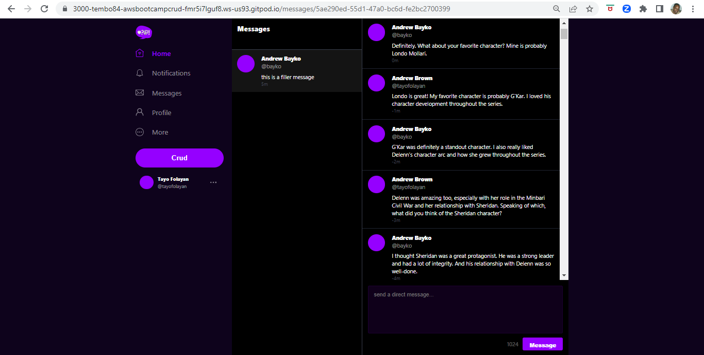
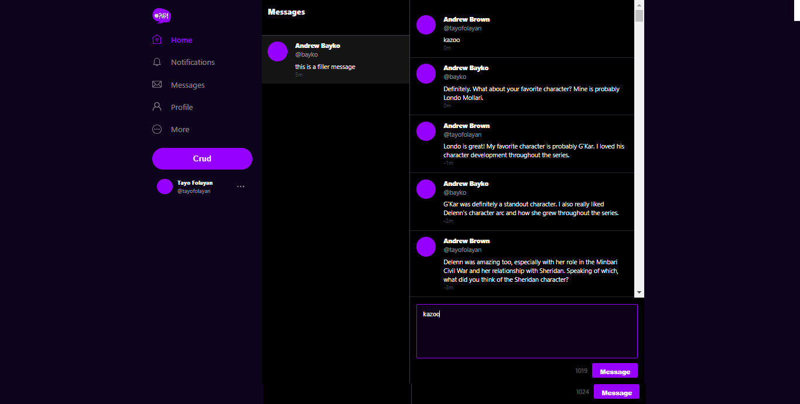

# Week 5 — DynamoDB and Serverless Caching

## Required Homework
This week I focused on NoSQL Databases, specifically DynamoDB. Up to this point this was the most challenging part of the project with non-stop troubleshooting. I created Bash Script for DynamoDB, I updated my cognito ID for Postgres, and I got a mock conversation from ChatGPT which I added to the database so that it could show up in the direct messages on the Cruddur app. I also updated the app to enable added new messages in real time from the app direct message interface. 

### DynamoDB Bash Script
In this image I show the bash script files that I implemented to Create the database, run the schema, and seed the messages. The script can also be enable to drop the database.

### AWS DynamoDB Cruddur-Message table
In this image I create my Cruddur-Messages table in AWS DynamoDB. It is coded in Lambda where DynamoDB is the trigger, and it is given all the necesssary security group permissions.

### AWS Lambda Function
... and here is the Lambda Function used for the DynamoDB table

### Cruddur Message List
In this image I show what the message list will look like in the Direct Message feature of Cruddur, when the messaging conversation is listed out between two users.

### Updating Cruddur Message List
With this screenshot I show a real time update of the Cruddur Message list. You can see that I write the word "Kazoo" into the 'add direct message' feature. You can see the real time update at the top of the message list.

